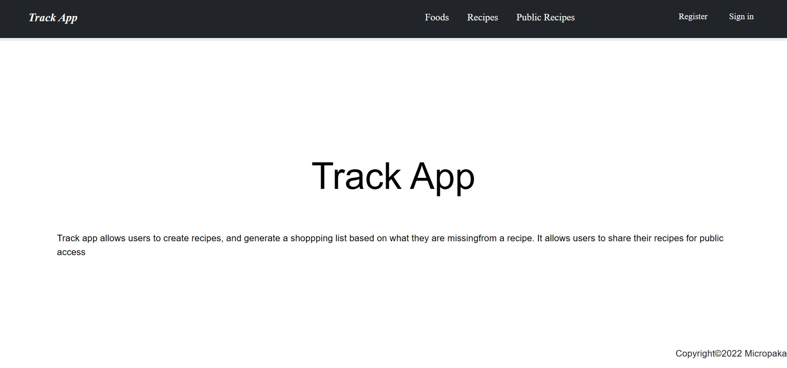

# The `Track App` on RoR

> Track Application allows users to create recipes, and generate a shopping list based on wht they have and 
what they are missing from a recipe. Also, it allows users to share their recipes for public access.

### Build with:

- Ruby
- Rails
- PostgreSQL
- Front end stack

## What is displayed:

- Login page and registration page
- Navigation menu
- Food list
- Recipies list
- Public recipe list
- Recipe details
- General shopping list view

## Getting Started

- make sure you have Ruby and Postgresql installed on your system.
- install rails by running `gem install rails`
- git clone git@github.com:OLIPLICHE/track_app.git
- cd ./track_app
- run `yarn install` or `bundle install` to install all dependencies
- run `rails db:create` and `rails db:migrate` to create database.
- run `rails s` and go to http:localhost:3000 to view the app.

## Run test

- install npm with `npm i`
- install rspec with `bundle install` and `rails generate rspec:install`
- run the test with `rspec spec`

## Author

👤 **Olipliche Mavoungou Paka**
- GitHub: [Olipliche Mavoungou Paka](https://github.com/OLIPLICHE)
- LinkdIn: [Olipliche Mavoungou Paka](https://www.linkedin.com/in/olipliche/)
- Twitter: [Olipliche Mavoungou Paka](@olipliche1)

## Collaborator
👤 **Elmar Abdulkarimov**

- GitHub: [Elmar Abdulkarimov](https://github.com/elmar8287)

## 🤝 Contributing

Contributions, issues, and feature requests are welcome!

Feel free to check the [issues page](../../issues/).

## Show your support

Give a ⭐️ if you like this project!

## Acknowledgments

- Hat tip to anyone whose code was used
- Inspiration
- etc
